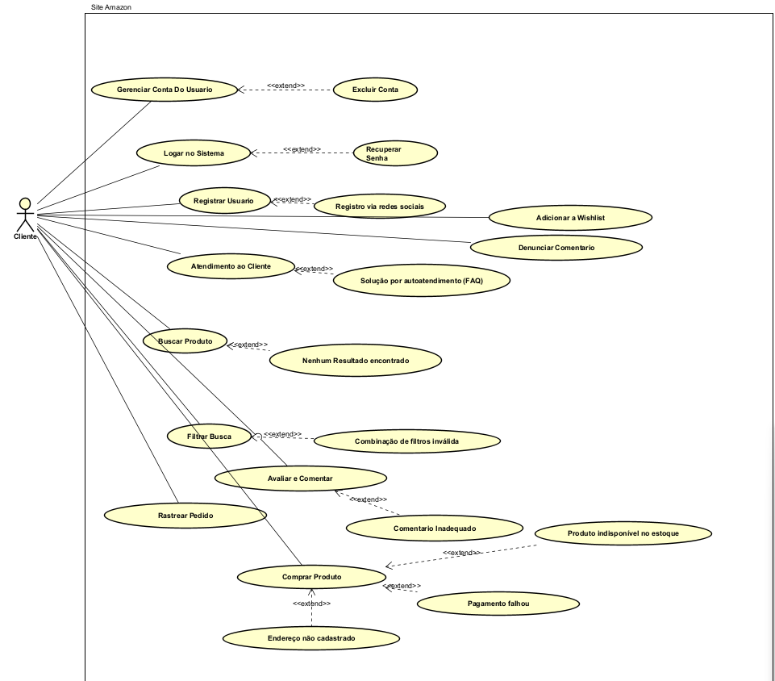

## O que é Caso de Uso?

Caso de Uso é uma técnica utilizada no desenvolvimento de software para capturar requisitos funcionais do sistema. Ele descreve as interações entre os usuários (atores) e o sistema para alcançar um objetivo específico. Essa abordagem ajuda a garantir que o sistema final atenda às necessidades dos usuários.

## Benefícios dos Casos de Uso

- **Clareza**: Proporciona uma compreensão clara de como o sistema deve se comportar.
- **Orientação ao Usuário**: Centra-se nas necessidades e experiências do usuário.
- **Comunicação**: Facilita a comunicação entre membros da equipe técnica e não técnica.
- **Planejamento de Testes**: Auxilia na criação de testes de aceitação.

## Conclusão

Casos de Uso são ferramentas poderosas para entender as funcionalidades necessárias em um sistema de software. Eles são especialmente úteis para garantir que todas as partes interessadas tenham uma compreensão comum do que o sistema deve fazer, melhorando assim o processo de desenvolvimento e garantindo uma melhor qualidade do produto final.

## Diagrama de Caso de Uso
O diagrama de caso de uso apresentado visualiza as funcionalidades do site da Amazon através da perspectiva de um cliente. Este diagrama detalha as várias interações possíveis entre o cliente e o sistema, organizando os casos de uso de maneira que os relacionamentos e dependências sejam claros e compreensíveis.

## Histórico de Versão

| Versão   | Data       | Autor(es)                                  | Descrição                                                                                   |
|----------|------------|--------------------------------------------|---------------------------------------------------------------------------------------------|
| `0.1`    | 25-01-2025 | [Tales](https://github.com/talesrg)     | Versão inicial do documento/projeto.                                                        |