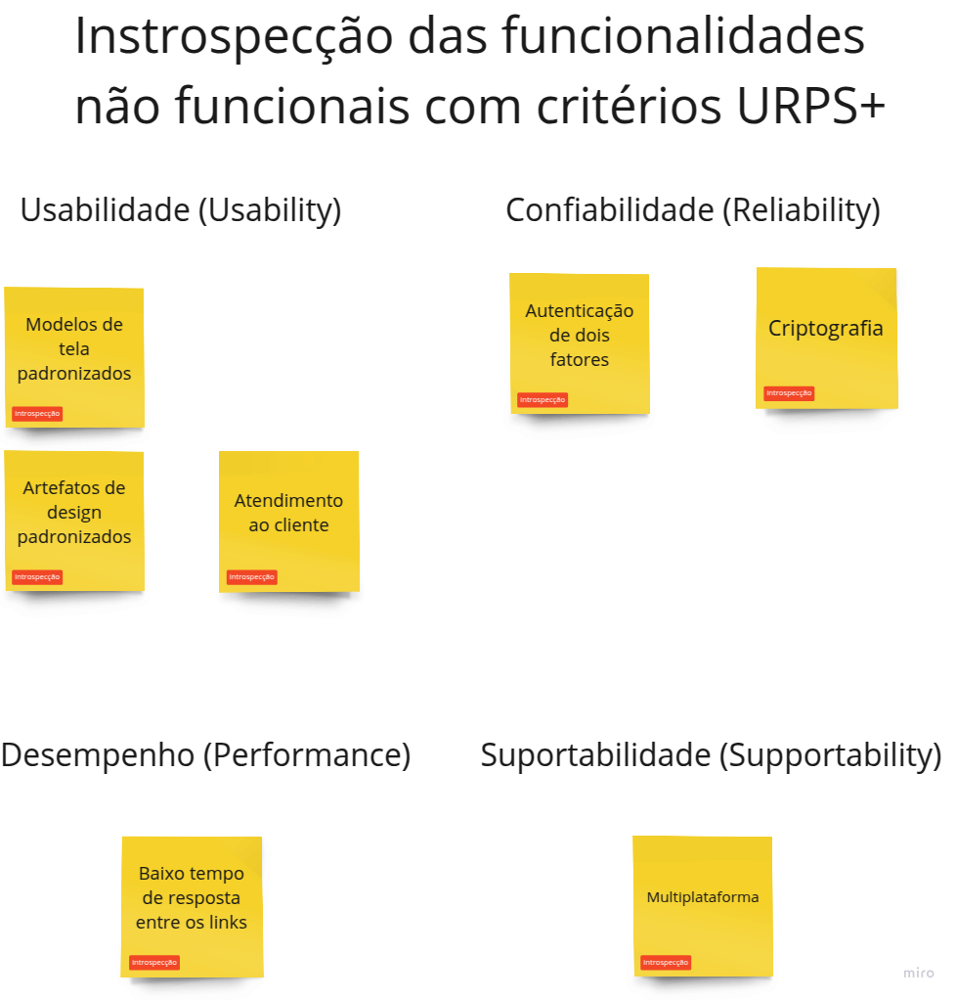

# Levantamento e Priorização de Requisitos

## Objetivo

O objetivo desta etapa foi o levantamento de **requisitos funcionais** e **não funcionais** do app da [Amazon](https://www.amazon.com.br/). Para este processo foi utilizado diversas técnicas com com o auxílio do [Miro](https://miro.com/).


## Elicitação dos requisitos

Para fazer a elicitação de requisitos, utilizamos as técnicas de **[Introspecção](#introspecção)**, **[Observação Passiva](#observação-passiva)** e **[URPS](#urps)**, este como uma técninca para os não funcionais. A técnica foi escolhida por ser uma das mais eficazes para identificar e compreender os requisitos.

### Elicitação - Introspecção

Nesta etapa foi feita a introspecção de funcionalidades *funcionais* e *não funcionais*. 


#### Funcionais


Dessa forma, foi possível identificar as seguintes funcionalidades:

01. **Login de usuário**  
02. **Registrar de usuário**  
03. **Atendimento ao Cliente**  
04. **Buscar produto**  
05. **Avisos de mudança de preço no carrinho**  
06. **Denunciar comentários**  
07. **Filtrar busca**  
08. **Avaliações e Comentários de Produtos**  
09. **Rastrear Pedidos**  
10. **Wishlist**  
11. **Assinaturas e Serviços Premium (como Amazon Prime)**  
12. **Carrinho de Compras**  
13. **Pagamento**  
14. **Selecionar categoria**  
15. **Notificações**  


#### Não Funcionais



Dessa forma, foi possível identificar as seguintes funcionalidades não funcionais:

##### Usabilidade (Usability)
01. **Modelos de tela padronizados**  
02. **Artefatos de design padronizados**  
03. **Atendimento ao cliente**

##### Confiabilidade (Reliability)
04. **Criptografia**  
05. **Autenticação de dois fatores**

##### Desempenho (Performance)
06. **Baixo tempo de resposta entre os links**

##### Suportabilidade (Supportability)
07. **Multiplataforma**


### Elicitação - Observação Passiva

Nesta etapa foi feita a observação passiva de funcionalidades *funcionais*. 


#### Funcionais


Dessa forma, foi possível identificar as seguintes funcionalidades:

01. **Opção de entrega**  
02. **Opção de seguro**  
03. **Adicionar endereço**  
04. **Especificações técnicas**  
05. **Solicitar CPF**  
06. **Pagamento pix**  
07. **Comparativo com outros produtos**


## Priorização dos requisitos

Com as funcionalidades identificadas, foi feito o processo de declaração dos requisitos e sua priorização com a técnica do [MoSCoW](#moscow).

### Declaração e Priorização dos requisitos 

Com todas as funcionalidades encontradas, vamos ao processo de declaração dos requisitos seguindo este modelo 

```
O sistema deve <ação> para <objetivo>.
```

#### Funcionais


| **Funcionalidades**                                                                                                  | **Requisitos**                                                                                      | **Priorização** |
|----------------------------------------------------------------------------------------------------------------------|----------------------------------------------------------------------------------------------------|-----------------|
| Gerenciar conta do Usuário <br><br> Login de usuário <br><br> Registrar de usuário                                   | **R01** O sistema deve ser capaz de registrar um usuário para que possa acessar sua conta da Amazon.   | Should          |
| Atendimento ao Cliente                                                                                               | **R02** O sistema deve permitir um espaço para atendimento ao cliente para ajudar os usuários.         | Could           |
| Buscar produto <br><br> Filtrar busca                                                                               | **R03** O sistema deve ser capaz de buscar certo produto para que o usuário consiga encontrar.         | Must            |
| Avaliações e Comentários de Produtos <br><br> Denunciar comentários                                                 | **R04** O sistema deve ser capaz de mostrar e permitir usuários comentarem, avaliarem e denunciarem pedidos. | Must        |
| Wishlist                                                                                                            | **R05** O sistema deve ser capaz de criar uma lista de desejados do usuário.                           | Could           |
| Rastrear Pedidos                                                                                                    | **R06** O sistema deve ser capaz de fornecer a localização atual do transporte do produto.             | Should          |
| Notificações                                                                                                        | **R07** O sistema deve ser capaz de enviar notificações para os usuários.                              | Should          |
| Carrinho de Compras                                                                                                 | **R08** O sistema deve ser capaz de armazenar produtos selecionados pelo usuário.                      | Must            |
| Pagamento <br><br> Opção de entrega <br><br> Solicitar CPF <br><br> Selecionar tipo de pagamento                    | **R09** O sistema deve ser capaz de realizar o pagamento dos produtos do usuário.                      | Must            |
| Selecionar categoria                                                                                                | **R010** O sistema deve ser capaz de selecionar uma categoria desejada pelo cliente.                   | Should          |
| Assinaturas e Serviços Premium (como Amazon Prime)                                                                  | **R011** O sistema deve ser capaz de permitir que o usuário gerencie e veja os benefícios de suas assinaturas. | Could    |
| Avisos de mudança de preço no carrinho                                                                              | **R012** O sistema deve ser capaz de notificar o usuário caso o preço de um produto seja alterado pelo vendedor. | Must     |
| Opção de seguro                                                                                                     | **R013** O sistema deve ser capaz de dar uma opção de seguro para o cliente na compra de um produto eletrônico. | Would    |
| Adicionar endereço                                                                                                  | **R014** O sistema deve ser capaz de permitir que o usuário altere ou adicione um novo endereço.       | Must            |
| Especificações técnicas                                                                                            | **R015** O sistema deve ser capaz de mostrar as especificações técnicas do produto com o máximo de detalhes. | Must       |
| Comparativo com outros produtos                                                                                     | **R016** O sistema deve ser capaz de mostrar um comparativo com outros produtos semelhantes.           | Could           |
| Gerencia de conteúdos e dispositivos                                                                                | **R017** O sistema deve ser capaz de gerenciar os dispositivos vinculados ao mesmo usuário e conteúdos. | Could           |


#### Não Funcionais

> Obs: Não houve priorização dos requisitos não funcionais, já que eles são uma parte essencial do sistema.

| **Funcionalidades**                               | **Requisitos**                                                                                                    |
|---------------------------------------------------|------------------------------------------------------------------------------------------------------------------|
| Modelos de tela padronizados                      | **RNF01** O sistema deve possuir modelos de tela personalizados e definidos para toda a sua extensão.            |
| Artefatos de design padronizados                  | **RNF02** O sistema deve possuir artefatos de design padronizados e definidos por toda a sua extensão.            |
| Atendimento ao cliente                            | **RNF03** O sistema deve possuir um suporte para atender os problemas dos usuários.                               |
| Autenticação de dois fatores                      | **RNF04** O sistema deve possuir autenticação de dois fatores para garantir uma maior segurança para o usuário.    |
| Criptografia                                      | **RNF05** O sistema deve ser capaz de criptografar os dados pessoais do usuário.                                  |
| Baixo tempo de resposta entre os links            | **RNF06** O sistema deve possuir um baixo tempo de resposta entre a sua navegação interna.                        |
| Multiplataforma                                   | **RNF07** O sistema deve ser capaz de rodar em diversos dispositivos como mobile e desktop.                       |


## Técnicas Utilizadas

### Introspecção

#### O que é?

De acordo com o [PUC-Rio - Certificação Digital N0 0521479/CA](https://www2.dbd.puc-rio.br/pergamum/tesesabertas/0521479_08_cap_02.pdf), "A técnica de
introspecção se baseia em imaginar que tipo de sistema eu iria querer se eu estivesse executando esta tarefa, utilizando este equipamento, entre outros. Ou
seja, imaginar que propriedades um sistema deveria possuir de forma a obter sucesso."

#### Por que utilizamos?

Esta técnica foi utilizada para identificar os requisitos funcionais e não funcionais do app da Amazon, pois ela é de fácil implementação e leva em consideração a experiência que os integrantes da equipe têm com o uso de aplicativos de e-commerce. E com o auxílio do Miro, foi possível organizar as ideias de forma clara e objetiva.

### Observação Passiva

### URPS

#### O que é?

Esta é uma técnica que organiza os requisitos funcionais em quatro categorias: **Usabilidade(Usability)**, **Confiabilidade**, **Desempenho (Performance)** e **Suportabilidade (Supportability)**:

- **Usabilidade(Usability)**: São os requisitos que definem a facilidade do uso do sistema, assistentes virutais, documentação para usuários e materiais de treinamento;
- **Confiabilidade(Reliability)**: São os requisitos de definem a gravidade de falha, previsão de falahas;
- **Desempenho (Performance)**: São os requisitos de velocidade, tempo de resposta, capacidade de processamento do app;
- **Suportabilidade (Supportability)**: São os requisitos de manutenção, configuração, instalação e configuração do app.

#### Por que utilizamos?

Essa técninca foi utilizada para organizar e facilitar a identificação das funcionalidades, e consequentemente, os requisitos não funcionais do app da Amazon.

### MoSCoW


#### O que é?

A [técnica](https://www.productplan.com/glossary/moscow-prioritization/#:~:text=MoSCoW%20prioritization%2C%20also%20known%20as,will%20not%20have%20right%20now.) foi utilizada com uma ferramenta para verificar as partes mais importantes para o bom funcionamento do aplicativo, no formato de quatro categorias:
 
- **Must(deve ter)**: Funcionalidades indispensáveis para o bom funcionamento do sistema;
- **Should(deveria ter)**: Funcionalidades importantes porém não indispensáveis;
- **Could(poderia ter)**: Funcionalidades interessantes que podem ser implementadas futuramente se houver recursos;
- **Would(não será implementado agora)**: Funcionalidades que podem ser adiadas para futuras atualizações.


#### Por que utilizamos?

A técnica foi utilizada devido a sua utilidade para facilitar a priorização de tarefas que devem ser feitas primeiro e por ser uma técnica simples, adaptável e eficaz para uma equipe gerenciar o projeto.


## Extra

<iframe width="768" height="432" src="https://miro.com/app/board/uXjVLpqxwc0=/?share_link_id=981689860925" frameborder="0" scrolling="no" allow="fullscreen; clipboard-read; clipboard-write" allowfullscreen></iframe>


## Histórico de Versão

| Versão   | Data       | Autor(es)                                  | Descrição                                                                                   |
|----------|------------|--------------------------------------------|---------------------------------------------------------------------------------------------|
| `0.1`    | 25-01-2025 | [Bruno](https://github.com/brunobreis), [Júnio](https://github.com/Juniossilva173)     | Versão inicial do documento.                                                        |