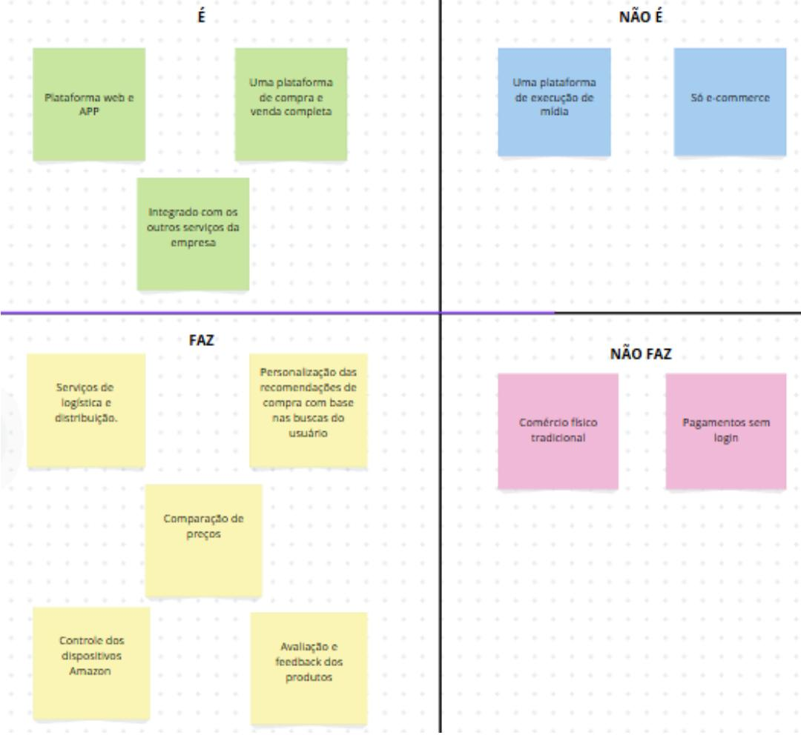

# 

O app da [Amazon](https://www.amazon.com.br/), é responsável por centralizar os produtos da multinacional - que tem foco em **e-commerce**, computação em nuvem, streaming e IA -, possibilitando a assinatura e gerência dos diversos serviços da marca.

## Visão do produto

Nesse tópico, analisaremos os requisitos e serviços prestados pelo Amazon App. Definindo sua visão geral e contribuição para resolução de problemas.

### 1. Qual é o diferencial do pruduto?

Rapidez no processamento e entrega dos produtos, com preços competitivos e alcance global. Interface intuitiva e personalizada, com grande suporte de atendimento ao cliente.

### 2. Público alvo

Pessoas que buscam praticidade na compra e venda de produtos com entrega rápida no conforto do seu lar - além de preços acessíveis e variedade de opções.

### 3. Vantagens

Além de eventos anuais com descontos relevantes para o consumidor, a Amazon, diferente de outros e-commerces, trabalha com sistemas de estocagem e logística que permitem a entrega de qualquer produto em menos de 3 dias.  

### 4. Descrição do produto:

#### 4.1 Alvo

Consumidores e fornecedores de produtos dos mais variados ramos.

#### 4.2 Usuário

Qualquer usuário com acesso a internet ou que possua o app.

#### 4.3 O que é?

O Amazon App não é apenas uma plataforma de compras online, mas uma plataforma que conecta os usuários a produtos, entretenimento, serviços financeiros e dispositivos inteligentes

#### 4.4 Utilidade

A Amazon distribui downloads e streaming de vídeo, música e audiolivros através de algumas sub empresas sob seu comando -  Prime Video, Amazon Music, Twitch e Audible. Tendo um braço editorial, a Amazon Publishing, um estúdio de cinema e televisão, Amazon Studios, e uma subsidiária de computação em nuvem, Amazon Web Services. Além disso, também produz eletrônicos de consumo, incluindo e-readers, tablets, TV Box, caixas de som, entre outros.

#### 4.5 Concorrentes

Shopee, Shein, Temu, Mercado Livre, Magalu, Ebay e Alibaba (AliExpress).

#### 4.6 Vantagens

Maior segurança contra fraudes, o acesso à plataforma também via web e entrega mais rápida.

### Problemática e objetivos da Amazon

A Amazon permite, em sua plataforma de vendas, que as pessoas tenham acesso a produtos com **rapidez** e **comodidade**, também sendo útil para a compra de serviços ou objetos que nem sempre estão disponíveis na região do consumidor com a mesma facilidade. Seu marketplace ainda permite vendas externas que ajudam produtores independentes e geram grande competitividade de preços na plataforma, favorecendo o cliente - que sempre poderá pegar as melhores ofertas.

No que diz respeito às outras áreas de atuação, a Amazon promove evoluções tecnológicas - como a Alexa, um dispositivo com IA integrada que auxilia muito no dia-a-dia dos consumidores -, e até mesmo ecológicas se considerarmos o Amazon Kindle e a forma como ele diminuiu a produção e descarte de livros físicos. 

### Definição do produto 

Utilizamos a ferramenta: é, não é, faz e não faz, para definir o conceito e função do app. Logo, temos:

## Técnincas utilizadas

### É, não é, faz e não faz

#### O que é?

A técnica de **[é, não é, faz e não faz](https://caroli.org/e-nao-e-faz-nao-faz/)**, desenvolvida pelo Caroli, é uma ferramenta que ajuda a definir o escopo do projeto. Ela é utilizada para definir o que o produto é, o que ele não é, o que ele faz e o que ele não faz.

#### Por que utilizamos?

Essa técnica foi utilizada para evitar mal-entendidos e garantir que todos do grupo tenham a mesma visão do app escolhido.

## Histórico de Versão

| Versão   | Data       | Autor(es)                                  | Descrição                                                                                   |
|----------|------------|--------------------------------------------|---------------------------------------------------------------------------------------------|
| `0.1`    | 25-01-2025 | [Bruno](https://github.com/brunobreis), [Júnio](https://github.com/Juniossilva173)     | Versão inicial do documento.                                                        |